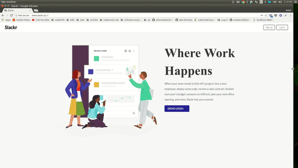
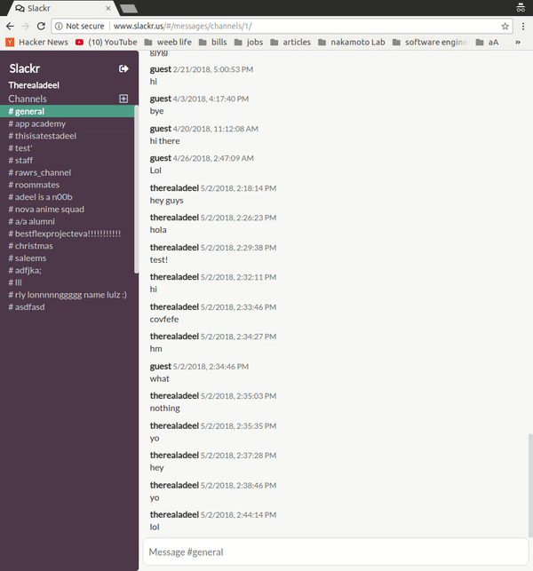
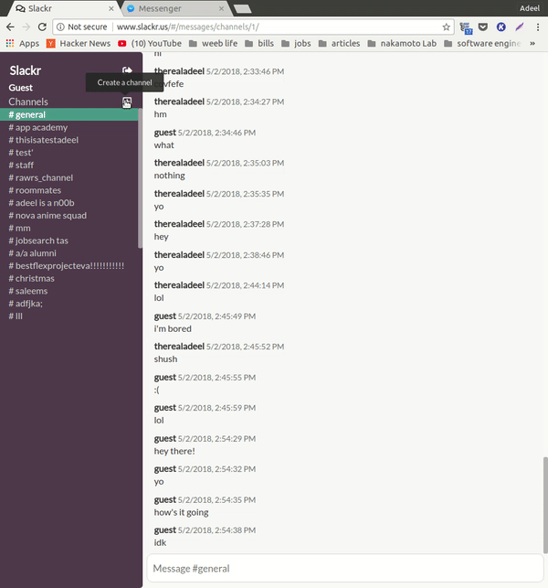
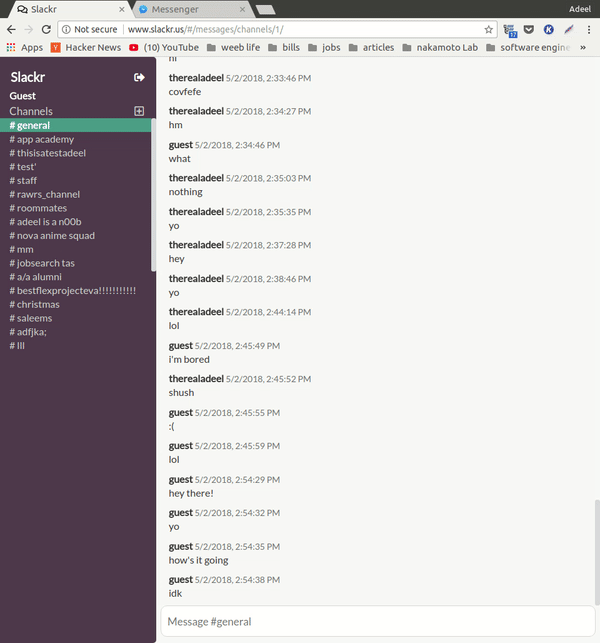

# Slackr

[Slackr Live][heroku]

[heroku]: www.slackr.us

Slackr is a web application clone of Slack developed with Rails and React/Redux.



## Features & Implementation

### User Authentication

slackr allows users to sign in/sign out securely with the implementation of BCrypt to generate salted hash from the user password, as such users' passwords are not stored in the database. In addition uniquely signed session tokens are generated for each user, ensuring each session belongs to he correct user.

```ruby
class User < ApplicationRecord
  before_validation :ensure_session_token
  #...
  def reset_session_token!
    self.session_token = SecureRandom.urlsafe_base64
    self.save!
    self.session_token
  end

  def ensure_session_token
    self.session_token = SecureRandom.urlsafe_base64
  end

  def password=(password)
    @password = password
    self.password_digest = BCrypt::Password.create(password)
  end

  def is_password?(password)
    BCrypt::Password.new(self.password_digest).is_password?(password)
  end
  #...
end
```

### Live Chat



Live chat requires a WebSocket connection to allow for an interactive communication between the user's browser and the server via a bidirectional binary protocol. Action Cable was introduced in Rails 5.1 as a means to integrate WebSocket connections; it's a fullstack implementation that involves a client-side JavaScript framework and a server-side Ruby framework.

The slackr React/Redux frontend is responsible for sending POST requests to the server at which point a messages controller is instantiated to handle and persist the message to the database as well as to send a JSON response back to the slackr frontend to update the Redux state.

When a message is created, it's then broadcasted to the channel it belongs to; the model for messages is polymorphic as it may belong to either a channel or direct/group message.  

```javascript
  class Message < ApplicationRecord
    validates :body, presence: true
    after_commit { MessageRelayJob.perform_later(self, self.interface) }

    belongs_to :user

    belongs_to :interface,
      polymorphic: true
  end  
```

*Note:* there is only ever one channel WebSocket open which is less taxing on the server and frontend.

```Ruby
class ChannelChannel < ApplicationCable::Channel
  def subscribed
  stream_from "channel_#{params[:channel_name]}"
  end
end
```
```javascript
class MessageRelayJob < ApplicationJob
  def perform(message, interface)
    message = Api::MessagesController.render(
      partial: 'api/messages/message',
      locals: { message: message }
    )
    ActionCable.server.broadcast("channel_#{interface.channel_name}",
                                 message: JSON.parse(message))
  end
end
```

The client subscribes to a WebSockets channel when the frontend channel feed component is mounted via the setSocket action thunk creator:

```javascript
class ChannelFeed extends Component {
  constructor(props) {
    super(props);
    this.state = {
      loading: true
    };
  }

  //...

  componentDidMount() {
    const channelId = this.props.match.params.channelId;
    Promise.all([
      this.props.fetchChannelMessagesWithUsers(channelId),
      this.props.fetchChannels()
    ]).then(() => this.setState({loading: false}));
  }

  render () {
    //...
      <ul>
        {
          this.props.messages.map(
            (message, idx) => {
              if (this.props.match.params.channelId == message.interface_id) {
                return (
                  <Message
                    key={message.id}
                    user={this.props.users[message.user_id]}
                    message={message}
                    />);
              } else {
                return null;
              }
            })
          }
      </ul>
  // ...
}

```

## Channels



Channels are live chat rooms available to all users that have signed up for slackr. A user may join and switch between channels by clicking on the respective channel name in the sidebar:


### Search
It is accessible by clicking the *Channels* title on the side bar section.



#### Implemented on the model level

channel Search functionality is enabled on the model level using SQL `WHERE`. `ILIKE` is preferred over `LIKE` for case-insensitive search.

```ruby
class Channel < ApplicationRecord
  #...
  def self.search(query)
    self.where("channel_name ILIKE ?",
                "%#{query}%")
  end
  #...
end

class Api::ChannelsController < ApplicationController
  #...
  def search
    @channels = Channel.search params[:query]
    render :index
  end
  #...
end
```

#### Submits Ajax requests to the server on idle

As text is entered into the input field, the component has a time out for 200 milliseconds, after which an Ajax request is sent to the server for the search -- this avoids overloading the server with requests while ensuring a smooth user experience.

```javascript
export default class ChannelSearch extends React.Component {
  constructor(props) {
    super(props);
    this.state = {
      query: ''
    };
  }

  searchChannels(e) {
    this.setState({
      query: e.target.value
    });
    clearTimeout(this.searching);
    this.searching = setTimeout(
      () => this.props.searchChannels(this.state.query),
      200
    );
  }

  render() {
    //...
    return (
      //...
        <input
          className="channel-search-input"
          ref='searchBox'
          type='text'
          placeholder='Enter channel name'
          value={query}
          onChange={e => this.searchChannels(e)} />
        <ul className='channel-search-results'>
          {channelSearchResults.map(result =>
            <ChannelSearchItem
              key={result.id}
              channel={result}
              addSubscriberToChannel={() =>
                addSubscriberToChannel(result.id).then(
                  () => searchChannels(query)
                )}
              currentUser={currentUser} />
          )}
        </ul>
      //...
  }
}
```